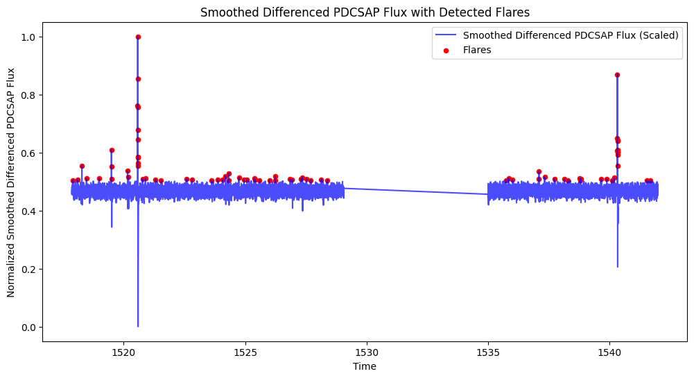

# Stellar Flare Detection in TESS Mission Data

## Project Overview

This project investigates the detection of stellar flares in photometric data collected by the Transiting Exoplanet Survey Satellite (TESS). Stellar flares are sudden bursts of electromagnetic radiation caused by the release of magnetic energy in a star's atmosphere. Detecting these events is important for understanding stellar magnetic activity, exoplanet habitability, and the physical processes governing stellar behavior.

Using time-series analysis and unsupervised learning techniques, this project develops methods for automatically identifying flare events in TESS light curves. The analysis focuses on star **TIC 0131799991** and compares two flare detection approaches: **Density-Based Spatial Clustering of Applications with Noise (DBSCAN)** and **Interquartile Range (IQR) outlier detection**. Additional preprocessing techniques, including smoothing and differencing, are used to reduce noise and remove deterministic trends from the data.



*Figure 1. Final stellar flare detections obtained using IQR-based anomaly detection after applying smoothing and differencing to the TESS light curve.*

---

## Research Questions

1. Can unsupervised learning methods effectively identify stellar flare events in TESS photometric data?
2. How does DBSCAN perform for flare detection compared to traditional outlier detection methods?
3. How do smoothing and differencing improve flare detection accuracy in noisy astronomical time-series data?

---

## Dataset

The dataset originates from the **Transiting Exoplanet Survey Satellite (TESS)** mission and contains high-cadence brightness measurements for **TIC 0131799991**. The primary variable of interest is **PDCSAP Flux**, a corrected measure of stellar brightness commonly used for flare detection. :contentReference[oaicite:1]{index=1}

---

## Methods

### Data Preprocessing
- Missing value removal
- Normality assessment
- Min-Max feature scaling
- Time-series smoothing
- First-order differencing

### Flare Detection

#### Density-Based Clustering (DBSCAN)
- Density-based clustering of flux observations
- Hyperparameter tuning of ε and minimum samples
- Feature engineering using:
  - Flux gradient
  - Rolling variance
  - Rolling skewness
  - Rolling kurtosis
  - Rolling spike counts

#### Outlier Detection (IQR)
- Interquartile Range (IQR) outlier detection
- Comparison of sensitivity thresholds
- Hyperparameter tuning using multiple IQR multipliers

### Model Evaluation

#### DBSCAN Metrics
- Silhouette Score
- Davies-Bouldin Index
- Calinski-Harabasz Index

#### IQR Metrics
- Outlier ratio
- Number of flare events detected
- Average flare duration
- Temporal consistency with known flare characteristics

---

## Key Findings

### DBSCAN

- Initial DBSCAN identified 21 flare events.
- Feature engineering and smoothing improved detection to 34 flare events.
- Clustering quality improved substantially:
  - Silhouette Score: -0.818 → 0.289
  - Davies-Bouldin Index: 18.75 → 0.80
  - Calinski-Harabasz Index: 5.24 → 135.24

### IQR Outlier Detection

- Initial IQR detection identified 116 candidate flare events.
- Differencing and smoothing reduced false positives.
- Final tuned model (k = 2) identified 26 significant flare events.
- Outlier ratio: 0.20%
- 7 distinct flare events detected over a 24.14-day observation period.
- Average flare duration: approximately 7.4 minutes. :contentReference[oaicite:2]{index=2}

### Conclusion

The combination of smoothing, differencing, and IQR-based anomaly detection provided the most reliable flare identification results. While DBSCAN successfully detected flare-like clusters, the refined IQR approach produced cleaner results and reduced the influence of noise and long-term trends. :contentReference[oaicite:3]{index=3}

---

## Repository Structure

```text
Stellar-Flare-Detection-in-TESS-Mission-Data/
│
├── analysis/
│   ├── data_preprocessing.ipynb
│   ├── dbscan.ipynb
│   └── iqr.ipynb
│
├── data/
│   ├── 0131799991.csv
│   ├── cleaned_star_data_with_differencing.csv
│   ├── cleaned_star_data_with_smoothing.csv
│   ├── cleaned_tess_data.csv
│   └── detected_flares_tuned.csv
│
├── eda/
│   └── STA2453_EDA.Rmd
│
├── figures/
│   ├── fig1.png
│   ├── fig2.png
│   ├── ...
│   └── fig6.png
│
├── report/
│   └── STA2453_Final_Report.pdf
│
└── README.md
```

---

## Software and Libraries

The analysis was conducted in **Python** using libraries including:

- pandas
- NumPy
- scikit-learn
- matplotlib
- scipy
- statsmodels

Additional exploratory analysis was performed using **R**.

---

## Reproducibility

1. Clone this repository.
2. Install required Python packages.
3. Load the TESS dataset contained in the `data/` folder.
4. Run the preprocessing notebook.
5. Execute the DBSCAN and IQR notebooks to reproduce flare detection results.

---

## Author

**Nevena Ciganovic**  
M.Sc. Statistical Sciences  
University of Toronto

---

## License

This repository is intended for academic and educational purposes. TESS data are publicly available through NASA's mission archives and remain subject to their respective usage policies.
